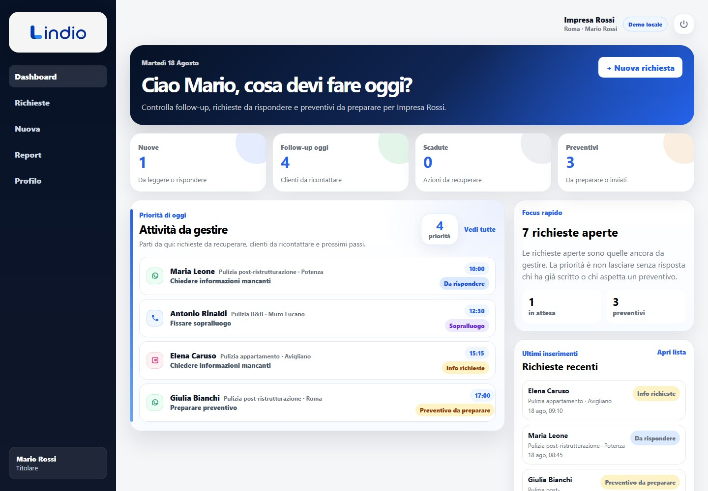
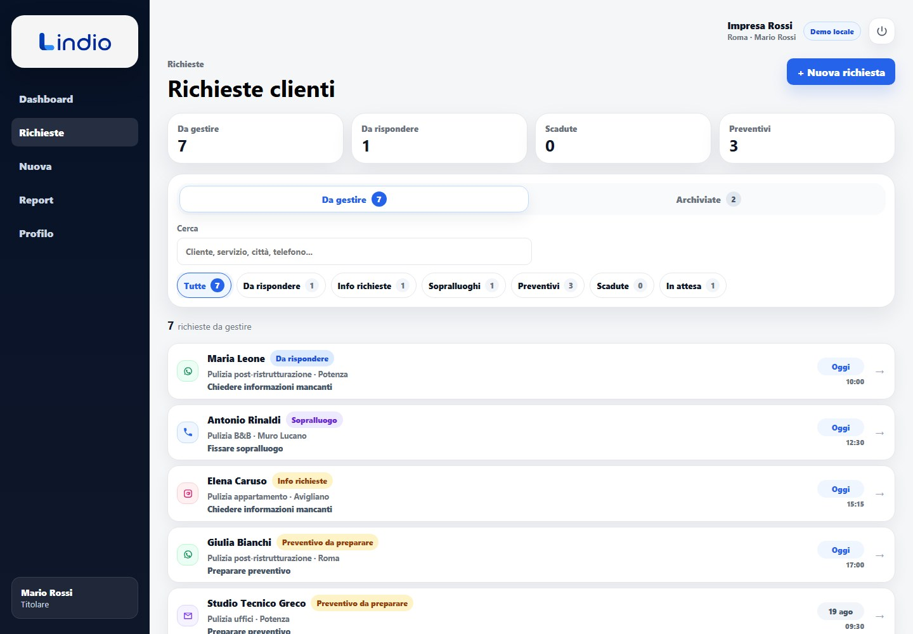
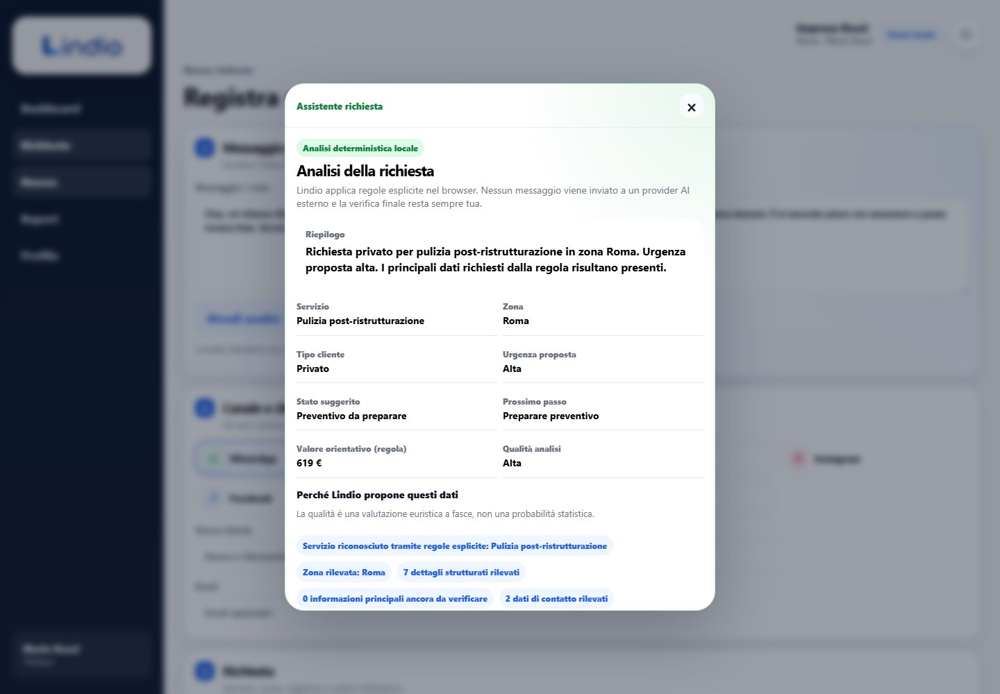
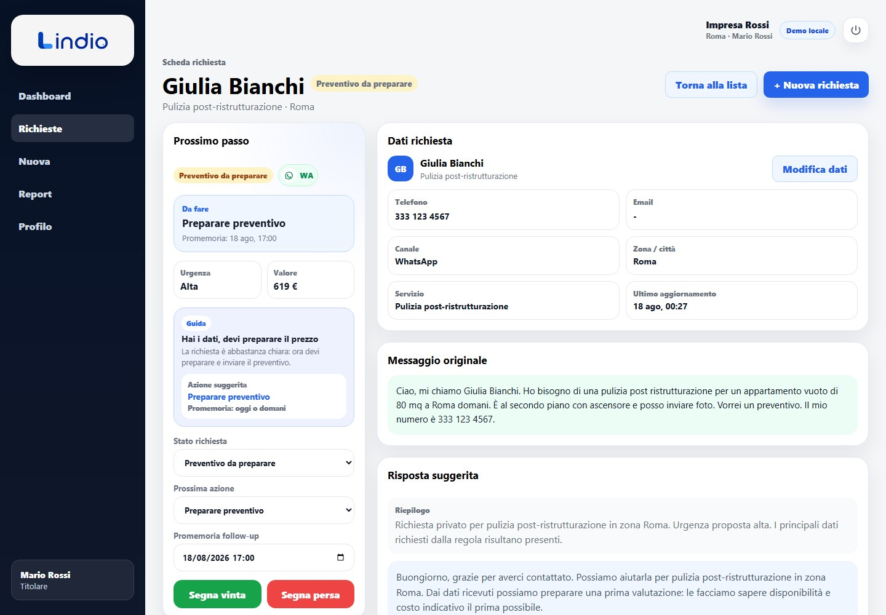
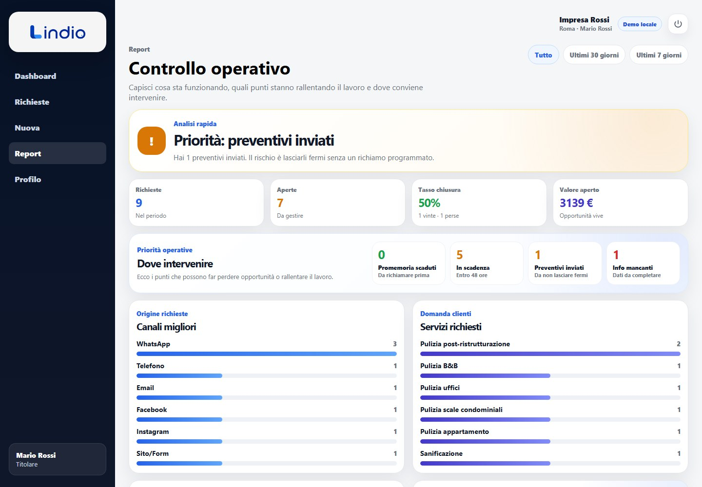
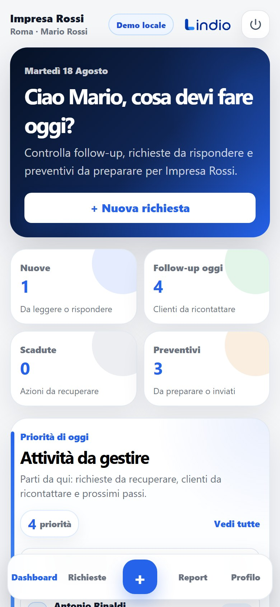

# Lindio

Lindio is a mobile-first PWA for small service businesses that need one operational place to turn fragmented customer requests into follow-ups, next actions and trackable commercial work.

A typical flow is:

```text
customer message / phone note
        ↓
structured request
        ↓
missing information + local deterministic analysis
        ↓
next action / reply draft
        ↓
status + follow-up + notes
        ↓
today / overdue / future operational views
```

The project is an engineering-focused MVP and portfolio repository. It demonstrates product-oriented software design, but this repository does **not** claim production adoption, revenue, customer counts, production-scale traffic or measured business outcomes.

## Reviewer-ready demo

The explicit Lindio demo is a browser-local, synthetic portfolio workspace. It can be explored without provisioning Supabase credentials and does not mutate a production database.

[Review Lindio in five minutes](docs/reviewer-walkthrough.md)



## Product tour

<table>
  <tr>
    <td width="50%" valign="top">
      <strong>Operational request inbox</strong>
      <p>
        Customer enquiries are grouped by the work still required: replies,
        missing information, site visits, quotes, overdue follow-ups and waiting states.
      </p>
      
    </td>
    <td width="50%" valign="top">
      <strong>Deterministic intake analysis</strong>
      <p>
        A local rule-based analyzer extracts supported request context, exposes
        missing information and proposes editable next steps without calling an external LLM.
      </p>
      
    </td>
  </tr>
  <tr>
    <td width="50%" valign="top">
      <strong>Workflow and follow-up</strong>
      <p>
        Each request keeps status, next action, follow-up timing, urgency and
        customer context together while preserving operator control.
      </p>
      
    </td>
    <td width="50%" valign="top">
      <strong>Operational reporting</strong>
      <p>
        Reports highlight workload, overdue actions, quote follow-ups, channel
        mix and service demand from the same request workflow.
      </p>
      
    </td>
  </tr>
</table>

### Mobile-first workflow

The Today dashboard and request inbox remain usable from a narrow mobile viewport.

<p align="center">
  
</p>

All people, businesses, contact details, requests and values visible in these screenshots are synthetic portfolio data. The assets are reproducibly generated from the production build with Playwright; see [the demo scenario](docs/demo-scenario.md).

## Why Lindio exists

Small service businesses often receive enquiries through WhatsApp, phone calls, email, social channels and web forms. The operational problem is not simply storing contacts: it is remembering what has to happen next, what information is still missing and which request needs attention today.

Lindio models that workflow without forcing an enterprise CRM process onto a micro-business. Operators can correct or skip commercial states when offline conversations require it, while persistence and concurrency rules still prevent silent data loss.

## Product capabilities

- capture requests from multiple intake channels;
- keep customer, service, location, urgency and estimated-value context together;
- run a **deterministic local intake analyzer** over pasted customer text;
- surface missing information, explainable analysis signals and an editable suggested reply;
- track status, next action, follow-up date and notes;
- show operational Today, Requests and Report views;
- use browser/device reminder notifications while Lindio is running or returns to the foreground;
- explore the complete supported local demo without provisioning Supabase credentials;
- use Supabase Auth + PostgreSQL + RLS for the real database-backed mode;
- install and reopen the production application as a PWA with a warm offline application shell.

### What the intake analyzer is — and is not

The default analyzer is rule-based and runs locally in the browser. It uses explicit rules, regular expressions and keyword matching. It does **not** call an LLM, require an AI provider key or send the raw customer message to an external AI provider as part of analysis.

Its quality level is an explainable heuristic band (`low`, `medium`, `high`), not a statistical probability. Suggestions remain editable and are never persisted automatically.

See [`docs/architecture/intake-analyzer.md`](docs/architecture/intake-analyzer.md).

## Execution modes

### Demo mode

`Esplora la demo` starts an explicit local-only session with synthetic data.

- no Supabase configuration is required;
- the demo session lives in `sessionStorage`;
- synthetic leads and demo account edits use browser storage;
- the UI clearly shows `Demo locale`;
- the same domain validation is reused by demo and database persistence paths.

Demo mode is a supported product path for reviewers, not a mocked static page.

### Database mode

Real accounts use:

```text
Supabase Auth
    ↓
profile + organization membership
    ↓
PostgreSQL / RLS
    ↓
transactional RPC commands
    ↓
validated lead + note state
```

`organization_members` is the authorization source of truth. Tenant-owned rows carry an `organization_id`, reads are protected by RLS, and lead workflow mutations go through transactional RPCs with optimistic concurrency rather than direct browser updates.

See [`docs/database.md`](docs/database.md) and [`docs/architecture/workflow-reliability.md`](docs/architecture/workflow-reliability.md).

## Architecture

The application keeps product, domain and infrastructure concerns deliberately separate:

```text
React / React Router
        ↓
App orchestration + lazy route boundaries
        ↓
application services
        ↓
typed domain validation / workflow rules
        ↓
repository boundaries
   ↙               ↘
local demo       Supabase adapters
                    ↓
             Auth + PostgreSQL
               + RLS + RPC
```

Important engineering decisions include:

- stable domain concepts are typed and runtime-validated without a big-bang TSX migration;
- the workflow remains product-permissive, but database writes are atomic and conflict-aware;
- database-backed lead updates use a `version` field to reject stale writes;
- tenant access is enforced in PostgreSQL, not inferred from frontend state;
- the deterministic analyzer is replaceable behind an application contract;
- PWA reminders are local/browser reminders, not misleadingly described as server Web Push;
- route and infrastructure code splitting reduced the validated initial JS entry from **585.19 kB / 171.25 kB gzip** to **265.32 kB / 87.26 kB gzip** without raising Vite's 500 kB warning threshold;
- CI protects the resulting bundle topology so the application cannot silently collapse back into one oversized JS chunk.

The bundle numbers above are production-build artifact measurements. They are not Lighthouse, Core Web Vitals or real-user performance claims.

## Stack

- React 18 + React Router
- Vite 7
- TypeScript boundaries for domain/application/repository code
- Supabase Auth
- PostgreSQL + Row Level Security
- transactional PostgreSQL RPCs
- local Supabase CLI + Docker
- Playwright
- pgTAP
- GitHub Actions
- Netlify deployment configuration
- Service Worker + Web App Manifest

## Local setup

### Prerequisites

- Node.js **24.18.0**
- npm 11.x (validated baseline: 11.16.0)
- Docker-compatible runtime for local Supabase database mode

The repository pins Node through `.nvmrc`; `package.json` accepts Node `>=24.18.0 <25`.

Install dependencies:

```bash
npm ci
```

### Run the demo only

No environment variables or database are required:

```bash
npm run dev
```

Open the Vite URL, choose **Esplora la demo**, and the application runs entirely with synthetic browser-local data.

### Reproduce the portfolio screenshots

The README assets use the same deterministic Playwright capture approach as the rest of the portfolio.

Install Chromium once if necessary:

```bash
npx playwright install chromium
```

Then run:

```bash
npm run demo:capture
```

The command builds the production application, serves it locally with `vite preview`, creates the canonical synthetic scenario through the real UI and writes eight JPEG files under `docs/assets/demo`.

No Supabase credentials or hosted demo account are required.

See [`docs/demo-scenario.md`](docs/demo-scenario.md).

### Run database-backed mode locally

Start the repository-pinned Supabase CLI:

```bash
npx supabase start
npx supabase db reset --local
```

Create `.env.local` from `.env.example`, then copy the local project URL and browser-safe anon/publishable key shown by:

```bash
npx supabase status
```

The local API is configured on `http://127.0.0.1:55321`. Never place a service-role key in a `VITE_*` environment variable.

Then run:

```bash
npm run dev
```

Local email confirmations are intentionally disabled in `supabase/config.toml` so signup/onboarding can be exercised without an external SMTP provider.

## Quality gates

### Frontend / release

```bash
npm run lint
npm run typecheck
npm run test:unit
npm run quality:deploy
```

`quality:deploy` executes:

```text
production build
→ bundle topology check
→ release-hygiene check
```

The release-hygiene gate inspects tracked files for environment files, generated/local state, high-signal secret patterns and absolute local workspace paths.

### Browser acceptance

```bash
npm run test:e2e
npm run test:pwa
```

The critical Playwright journey covers demo entry, deterministic intake analysis, lead creation, persistence, workflow mutation, notes, lazy Settings behavior and logout/private-route protection.

The separate PWA suite builds production assets, waits for service-worker control, checks manifest/icon/cache behavior and proves the warmed login application shell can render offline.

### Database

```bash
npx supabase db reset --local
npx supabase test db --local
npx supabase db lint --local --level warning --fail-on error
```

The pgTAP suite covers schema contracts, tenant isolation, onboarding boundaries, transactional commands, RPC-only mutation permissions and stale-write rejection.

Pull requests and pushes to `main` run frontend, browser/PWA and database jobs independently in GitHub Actions.

## Netlify deployment

`netlify.toml` is part of the repository so hosted behavior is reviewable and reproducible.

- runtime: Node 24.18.0;
- build: `npm run quality:deploy`;
- publish directory: `dist`;
- SPA routes fall back to `/index.html`;
- hashed `/assets/*` receive immutable caching;
- `/index.html` and `/sw.js` remain explicitly non-cacheable by the CDN so navigation and service-worker updates are not pinned to stale HTML;
- basic response hardening headers are configured centrally.

Demo mode works without hosted Supabase variables. For database-backed mode, configure these in the Netlify site environment:

```text
VITE_SUPABASE_URL
VITE_SUPABASE_ANON_KEY
```

Only the browser-safe publishable/anon key belongs in the frontend environment. Do not expose a service-role key.

For hosted password recovery/auth flows, configure the deployed origin and `/reset-password` destination in the Supabase Auth Site URL / allowed redirect URLs for that project.

## Security and privacy boundaries

- real `.env` files are ignored by Git;
- the committed `.env.example` contains placeholders only;
- RLS uses organization membership to isolate tenant data;
- lead + note mutations are server-authorized and transactional;
- stale updates are rejected instead of silently overwriting newer state;
- the default intake analyzer runs locally and does not send message text to an AI provider;
- demo data is synthetic and browser-local;
- database seed data is synthetic;
- portfolio screenshots are generated only from synthetic browser-local demo state;
- CI and the release-hygiene gate must be green before a public-release decision.

This is an MVP security model, not a claim of formal security certification or an external penetration test.

## PWA and reminder limitations

The application shell can reopen offline after the relevant production assets have been warmed while the service worker controls the page. This does **not** mean Supabase-backed data mutations work offline.

Reminder notifications are evaluated locally while Lindio is open/running or when it returns to the foreground. There is currently no Web Push backend, VAPID subscription infrastructure or server scheduler, so closed-app delivery is not guaranteed.

See [`docs/architecture/pwa-notifications.md`](docs/architecture/pwa-notifications.md).

## Documentation map

- [Database and tenancy](docs/database.md)
- [Authentication, onboarding and demo](docs/architecture/authentication-and-demo.md)
- [Domain model](docs/architecture/domain-model.md)
- [Workflow reliability and concurrency](docs/architecture/workflow-reliability.md)
- [Deterministic intake analyzer](docs/architecture/intake-analyzer.md)
- [PWA and reminder semantics](docs/architecture/pwa-notifications.md)
- [Performance and loading architecture](docs/architecture/performance-loading.md)
- [Testing strategy](docs/architecture/testing-strategy.md)
- [Synthetic demo scenario and screenshot contract](docs/demo-scenario.md)
- [Five-minute reviewer walkthrough](docs/reviewer-walkthrough.md)
- [Release readiness](docs/release-readiness.md)

## Current status and known limits

Lindio is a portfolio-oriented MVP, not a finished CRM platform. Current intentional limits include:

- the UI resolves one active workspace and does not expose a workspace switcher;
- there is no organization invitation flow or fine-grained role system beyond the current membership model;
- notifications are local/browser reminders rather than background server push;
- Supabase-backed mutations are not queued for offline synchronization;
- browser acceptance currently targets Chromium rather than a full compatibility matrix;
- hosted real-auth browser acceptance is not part of CI;
- no open-source license has been selected.

Future work should be driven by a concrete product requirement rather than by adding enterprise complexity for its own sake.

## Validation and portfolio claims

The repository is intended to make engineering decisions inspectable: migrations, RLS policies, transaction boundaries, validation, tests, CI, PWA behavior and bundle measurements are all represented in code or reproducible commands.

It should not be used to infer unreported customer adoption, revenue, production traffic, conversion impact, time savings or other business metrics. Any future user-validation results should be documented separately with their actual method and sample instead of being backfilled into the engineering history.

## License

No open-source license is currently declared for this repository. A future decision to make the repository public is separate from a decision to grant open-source reuse rights.
